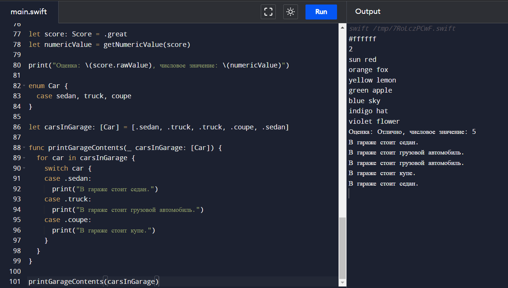

# vibe-lab-repo-6
0371 Копылов К.А.



```swift
enum Color: String {
  case white = "#ffffff"
  case black = "#000000"
}

enum Day: Int {
  case monday = 0, tuesday, wednesday, thursday, friday, saturday, sunday
}

print(Color.white.rawValue)
print(Day.wednesday.rawValue)

enum Gender {
  case male, female
}

enum AgeCategory {
  case child, teenager, adult, elderly
}

enum Experience {
  case junior, middle, senior
}

struct Employee {
  var name: String
  var gender: Gender
  var ageCategory: AgeCategory
  var experience: Experience
}

enum RainbowColor {
  case red, orange, yellow, green, blue, indigo, violet
}

func printRainbowColors() {
  let colors: [RainbowColor] = [.red, .orange, .yellow, .green, .blue, .indigo, .violet]
  for color in colors {
      switch color {
      case .red:
        print("sun red")
      case .orange:
        print("orange fox")
      case .yellow:
        print("yellow lemon")
      case .green:
        print("green apple")
      case .blue:
        print("blue sky")
      case .indigo:
        print("indigo hat")
      case .violet:
        print("violet flower")
      }
  }
}

printRainbowColors()

enum Score: String {
  case great = "Отлично", good = "Хорошо", satisfactory = "Удовлетворительно", needsImprovement = "Неудовлетворительно"
}

func getNumericValue(_ score: Score) -> Int {
  switch score {
    case .great:
      return 5
    case .good:
      return 4
    case .satisfactory:
      return 3
    case .needsImprovement:
      return 2
  }
}

let score: Score = .great
let numericValue = getNumericValue(score)

print("Оценка: \(score.rawValue), числовое значение: \(numericValue)")

enum Car {
  case sedan, truck, coupe
}

let carsInGarage: [Car] = [.sedan, .truck, .truck, .coupe, .sedan]

func printGarageContents(_ carsInGarage: [Car]) {
  for car in carsInGarage {
    switch car {
    case .sedan:
      print("В гараже стоит седан.")
    case .truck:
      print("В гараже стоит грузовой автомобиль.")
    case .coupe:
      print("В гараже стоит купе.")
    }
  }
}

printGarageContents(carsInGarage)
```
